# Car Rental System

A comprehensive Java Swing-based car rental management system that provides both customer and administrative interfaces for managing car rentals, user accounts, and pricing.

## Table of Contents

- [Features](#features)
- [System Requirements](#system-requirements)
- [Installation](#installation)
- [Running the Application](#running-the-application)
- [User Guide](#user-guide)
  - [Customer Interface](#customer-interface)
  - [Administrator Interface](#administrator-interface)
- [Project Structure](#project-structure)
- [Testing](#testing)
- [Technical Details](#technical-details)
- [Contributing](#contributing)

## Features

### Customer Features
- **User Registration & Authentication**: Create accounts and secure login
- **Customer Tier System**: Automatic upgrades/downgrades based on rental history
  - Regular Customer (0-4 reservations)
  - Bronze Customer (5-9 reservations): 5% discount on additional services
  - Silver Customer (10-19 reservations): 50% discount on final price
  - Gold Customer (20+ reservations): 50% discount on base price + 30% discount on additional services
- **Car Search & Filtering**: Search by manufacturer, model, comfort level, additional features, and date range
- **Real-time Pricing**: Dynamic pricing with seasonal adjustments, weekly/monthly discounts
- **Reservation Management**: Make, view, and modify future reservations
- **Rental History**: Track past rentals and transactions

### Administrative Features
- **Car Inventory Management**: Add, modify, and remove cars from the fleet
- **Real-time Fleet Monitoring**: View available and rented cars
- **Pricing Configuration**: Set and adjust pricing parameters, seasonal rates, and service charges
- **Rental History Analysis**: Search and filter rental records by date range and customer
- **Customer Database Management**: View customer information and rental patterns

### Car Features
- **Comfort Levels**: Basic, Standard, SUV, Luxury
- **Additional Features**: GPS, Child Seat, Insurance, Leather Interior, Sunroof, Hybrid Technology
- **Availability Tracking**: Real-time availability based on rental intervals
- **Modification Support**: Edit car details and manage rental schedules

## System Requirements

- **Java**: JDK 8 or higher
- **Operating System**: Windows, macOS, or Linux
- **Memory**: Minimum 512MB RAM
- **Storage**: 50MB free disk space

## Installation

1. **Clone or download the project**:
   ```bash
   git clone <repository-url>
   # or download and extract the ZIP file
   ```

2. **Navigate to the project directory**:
   ```bash
   cd CarRentalSystem
   ```

3. **Ensure required JAR files are present** in the `lib/` directory:
   - `junit-4.13.2.jar` (for testing)
   - `hamcrest-core-1.3.jar` (for testing)
   - `jcalendar-1.4.jar` (for date picker components)

4. **Compile the project**:
   ```bash
   # On Windows
   javac -cp "lib/*" -d . src/carrental/*.java src/carrental/*/*.java

   # On macOS/Linux
   javac -cp "lib/*" -d . src/carrental/*.java src/carrental/*/*.java
   ```

### Quick Setup Using Prebuilt JAR

Alternatively, you can run the application directly:

1. Download the latest `.jar` from the [Releases](../../releases) page
2. Run it with:

```bash
java -jar CarRentalSystem.jar
```

> Make sure you have Java 8 or higher installed.

## Running the Application

### Using Command Line

1. **Run the main application**:
   ```bash
   # On Windows
   java -cp ".;lib/*" carrental.CarRentalApp

   # On macOS/Linux
   java -cp ".:lib/*" carrental.CarRentalApp
   ```

### Using IDE

1. Import the project into your preferred Java IDE (Eclipse, IntelliJ IDEA, NetBeans)
2. Add the JAR files from the `lib/` directory to the project classpath
3. Run the `CarRentalApp.java` file as the main class

## User Guide

### Initial Setup

When you first run the application, you'll see the main interface with two options:
- **Customer Panel**: For regular users to rent cars
- **Administrator Panel**: For managing the car rental business

    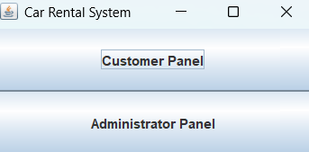

### Customer Interface

#### Registration and Login
1. Click "Customer Panel"
2. For new users: Click "Create Account" and fill in your details
3. For existing users: Enter username and password to login

    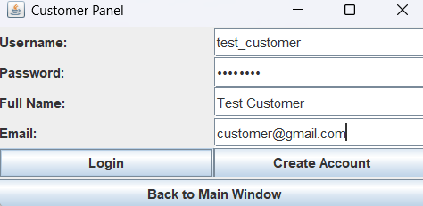 

#### Searching for Cars
1. Use the search panel to filter cars by:
   - **Manufacturer**: Toyota, Honda, etc.
   - **Model**: Specific car model
   - **Comfort Level**: Basic, Standard, SUV, Luxury
   - **Additional Features**: GPS, Child Seat, Insurance, etc.
   - **Date Range**: Rental start and end dates

2. Click *"Search"* to filter results or *"Clear All"* to reset

Examples:
- All cars available today:
  
    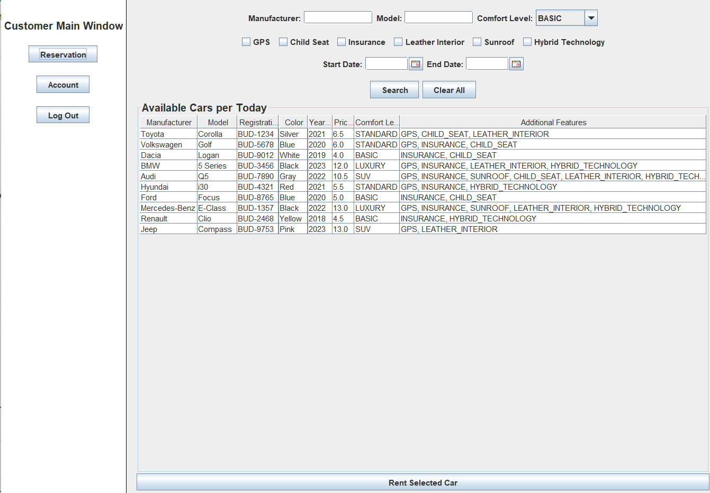 
- Luxury with GPS:
  
    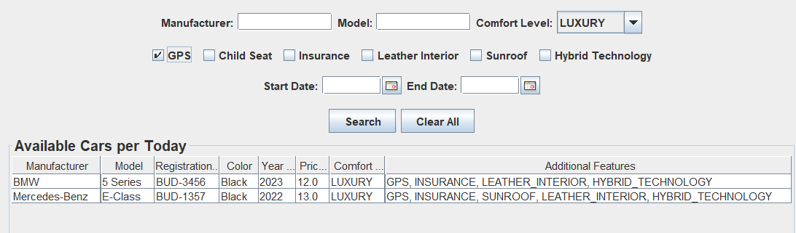 
- Standard and available between certain dates:
  
    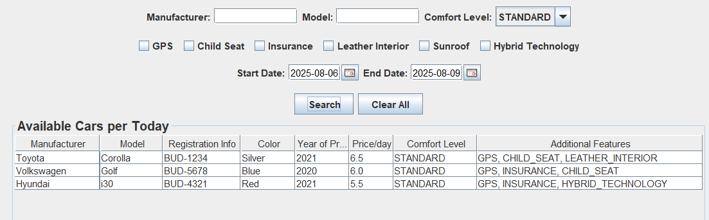


#### Making a Reservation
1. Select a car from the available cars table
2. Choose your rental dates using the date pickers
3. Review the pricing breakdown (includes seasonal adjustments and customer tier discounts)
4. Confirm the reservation

    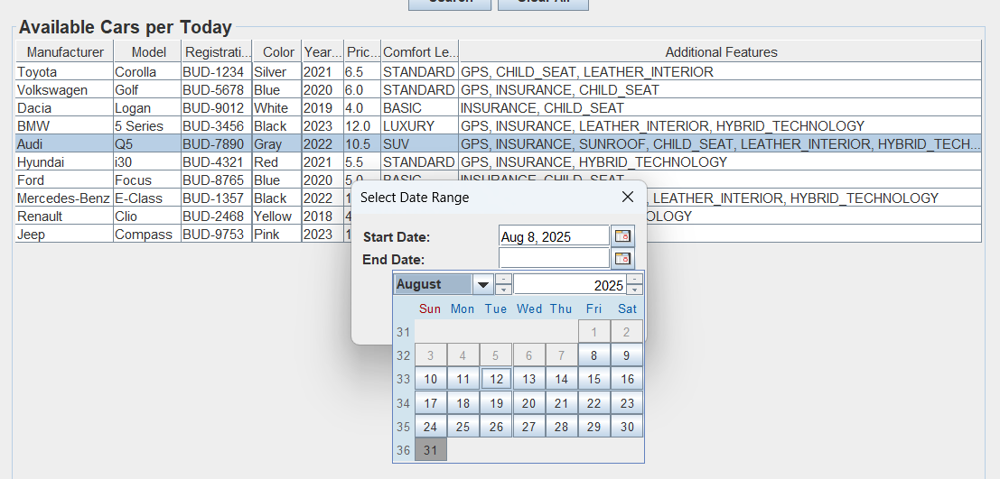 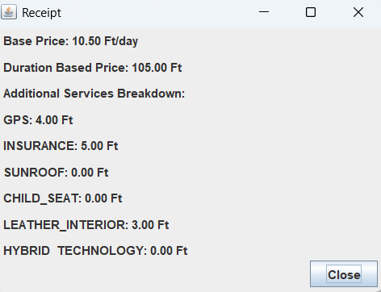


#### Managing Your Account
- View your customer tier and progress towards the next tier
- Check your rental history
- View and modify future reservations (if modification is allowed)

    **User profile:**

    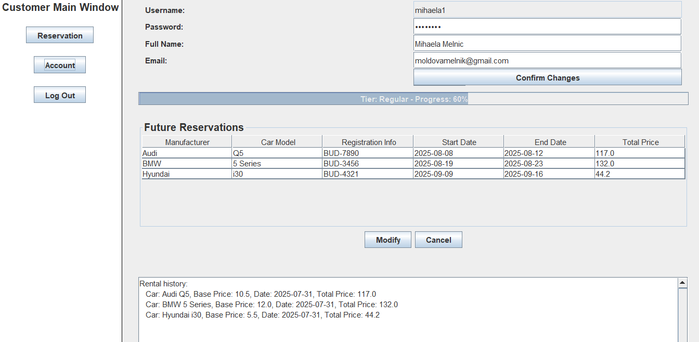

    Changing **personal information** requires password confirmation.

    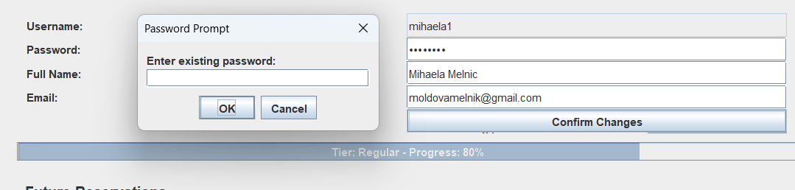

    Example of **modifying the dates** of the reservation and its successful result.

    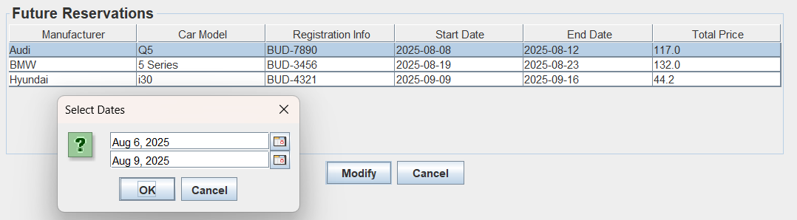
    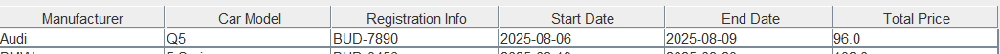

    **Cancelling** a reservation.

    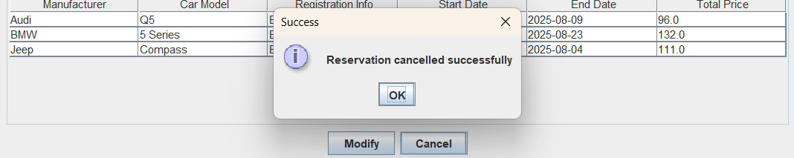

#### Customer Tier Benefits
- **Bronze**: 5% discount on additional services
- **Silver**: 50% discount on total rental price
- **Gold**: 50% discount on base price + 30% discount on additional services + priority booking

### Administrator Interface

#### Login
Use the default administrator credentials or create new admin accounts through the system.

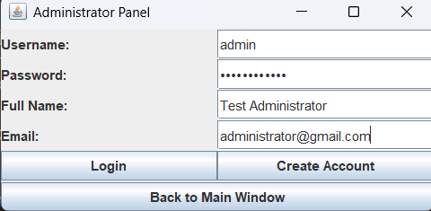 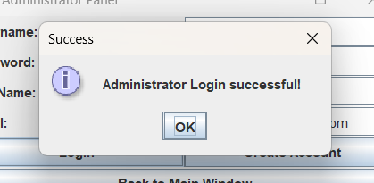

#### Car Inventory Management
1. **Adding Cars**:
   - Fill in car details (manufacturer, model, registration, color, year, price)
   - Select comfort level and additional features
   - Click "Add" to add to inventory

    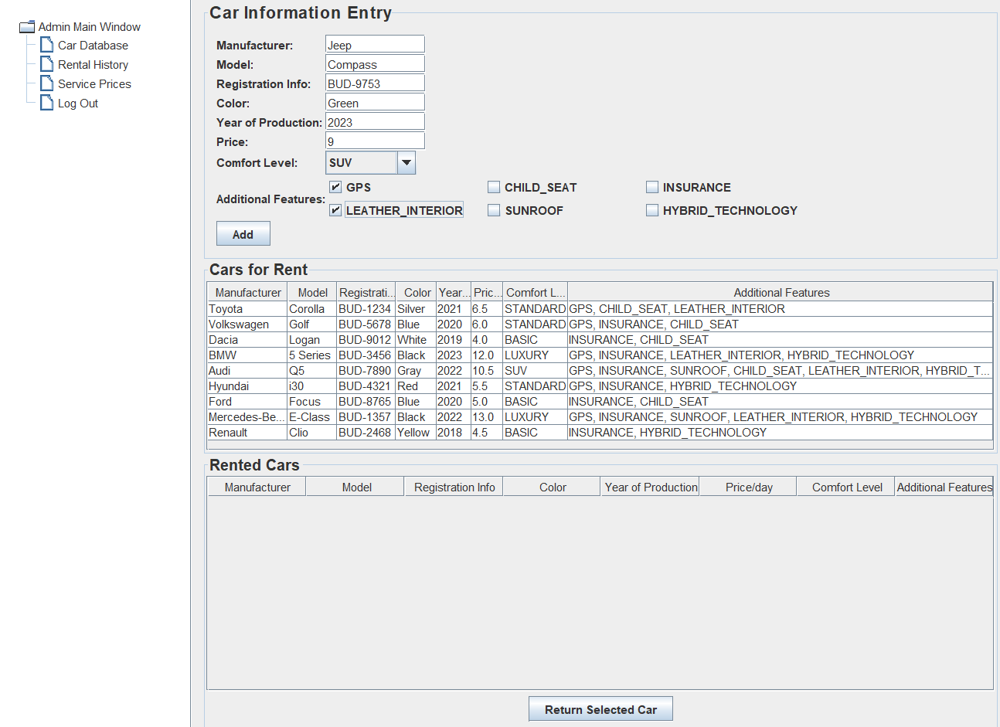

2. **Modifying Cars**:
   - Click on a car in the inventory table
   - Edit the details in the popup window
   - Save changes or delete the car
  
    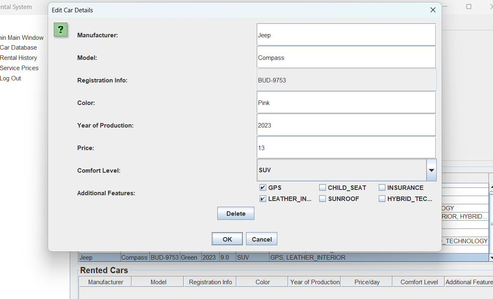

3. **Monitoring Fleet**:
   - View available cars (not currently rented)
   - View rented cars with return information
   - Return cars that have been brought back

    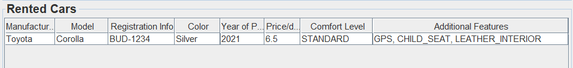

    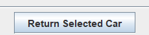

#### Pricing Management
1. Navigate to the "Prices" section
2. Set pricing parameters:
   - **Weekly/Monthly Discounts**: Percentage discounts for longer rentals
   - **Peak Season**: Define months and multiplier for high-demand periods
   - **Service Charges**: Set prices for additional features

    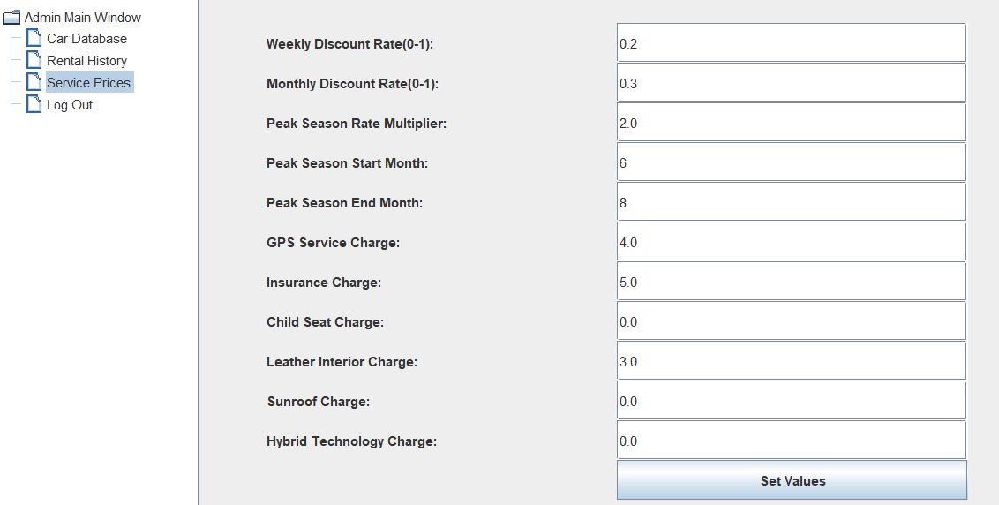


#### Rental History Analysis
1. Access the "Rental History" section
2. Search by date range to analyze business performance
3. View customer rental patterns and revenue data

    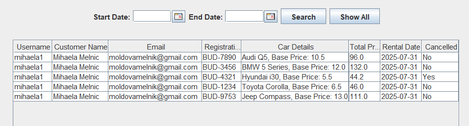

## Project Structure

```
CarRentalSystem/
├── lib/                              # External JAR dependencies
├── src/
│   ├── carrental/
│   │   ├── CarRentalApp.java        # Main application entry point
│   │   ├── exceptions/              # Custom exceptions
│   │   ├── gui/                     # User interface components
│   │   ├── models/                  # Data models and business logic
│   │   ├── panels/                  # UI panels for different views
│   │   ├── tables/                  # Table models and managers
│   │   └── util/                    # Utility classes and helpers
│   └── tests/                       # Unit tests
├── *.ser                            # Serialized data files
└── README.md                        # This file
```

### Key Components

- **Models**: `Car`, `Customer`, `Administrator`, `CarInventory`, `RentalHistory`, `PricingAttributes`
- **GUI**: Swing-based interfaces for customers and administrators
- **Utilities**: Authentication, pricing calculation, serialization
- **Data Persistence**: Serialization-based storage for all system data

## Testing

The project includes comprehensive unit tests for core functionality:

```bash
# Run tests (ensure JUnit is in classpath)
java -cp ".;lib/*" org.junit.runner.JUnitCore tests.CarInventoryTest
java -cp ".;lib/*" org.junit.runner.JUnitCore tests.CustomerAuthenticationTest
java -cp ".;lib/*" org.junit.runner.JUnitCore tests.PriceCalculationTest
java -cp ".;lib/*" org.junit.runner.JUnitCore tests.RentalHistoryTest
java -cp ".;lib/*" org.junit.runner.JUnitCore tests.CustomerProgressTrackerTest
```

### Test Coverage
- Car inventory operations (add, modify, remove, search)
- Customer authentication and tier management
- Price calculation algorithms
- Rental history management
- Customer progress tracking

## Technical Details

### Architecture
- **Pattern**: Model-View-Controller (MVC) architecture
- **GUI Framework**: Java Swing
- **Data Persistence**: Java Object Serialization
- **Concurrency**: Thread-safe operations for GUI updates

### Key Algorithms
- **Dynamic Pricing**: Seasonal adjustments, duration discounts, customer tier benefits
- **Availability Checking**: Interval overlap detection for car rentals
- **Customer Tier Management**: Automatic upgrades/downgrades based on rental count

### Data Storage
- Customer database: `customer_database.ser`
- Administrator database: `admin_database.ser`
- Car inventory: `carInventory.ser`
- Rental history: `rental_history.ser`
- Pricing configuration: `pricingAttributes.ser`

### Security Features
- Password-based authentication
- Input validation and sanitization
- Session management for logged-in users

## Contributing

This is an academic project developed for Programming 3 coursework. The system demonstrates object-oriented programming principles, GUI development, and software engineering best practices.

### Development Guidelines
- Follow Java naming conventions
- Maintain comprehensive JavaDoc documentation
- Include unit tests for new features
- Ensure proper error handling and user feedback

---

**Note**: This application uses serialization for data persistence. In a production environment, consider using a proper database system for better reliability and concurrent access support.
